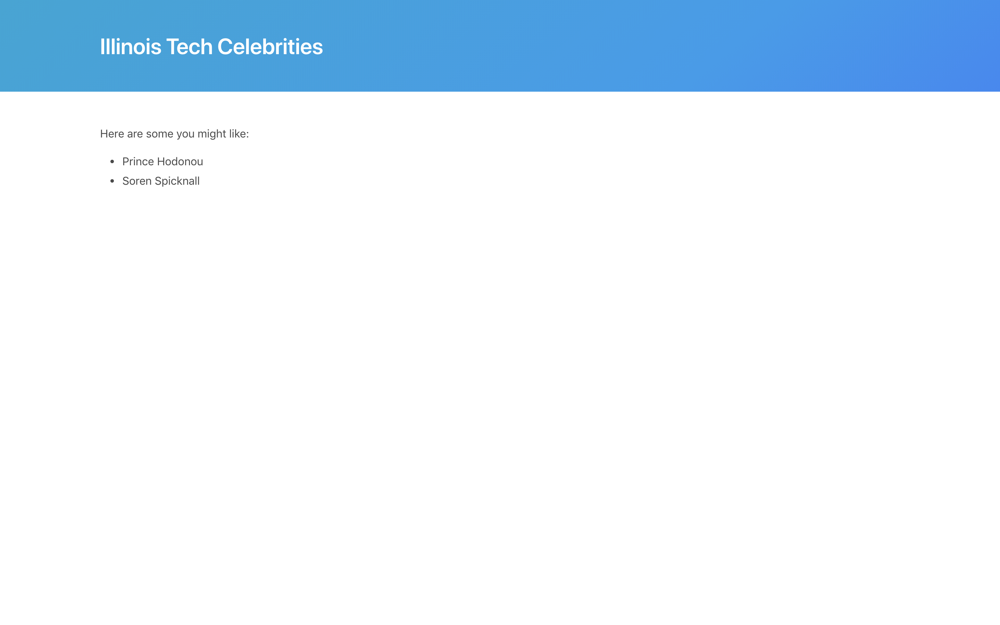
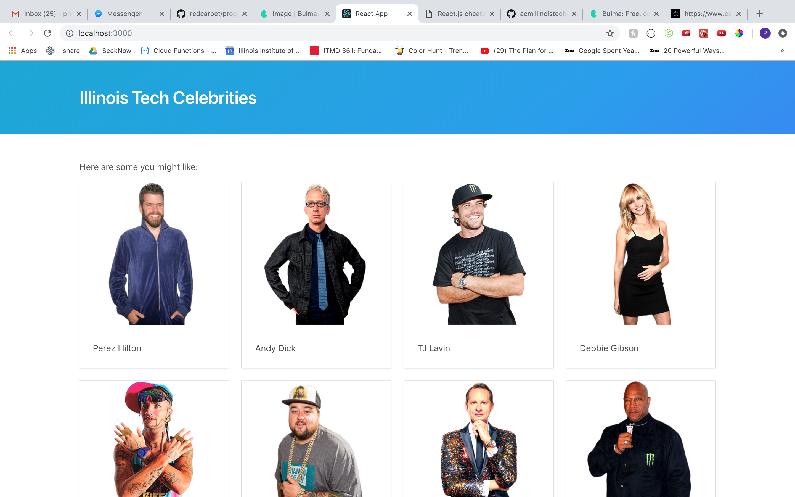

# Progress Log

## Milestones

- [x] Set up basic React project
- [ ] Create a `TileList` component
- [ ] Add more properties for each celebrity
- [ ] Modularize the recommender algorithm
- [ ] Improve user interface

## Goal

## Entries

### 2/10/2019 (Vinesh)

- Set up project with [Create React App](https://github.com/facebook/create-react-app).
- Added [Bulma](https://bulma.io/) stylesheet because:
    - Using Bulma allows us to focus on layout instead of writing lots of CSS from scratch
    - Bulma includes all the CSS classes we might need
    - Vinesh is very familiar with the framework
- Created a `Tile` component. Is this the best name for the component?

### 2/13/2019 (Prince, Erick, Vinesh)

- Added a column layout using is-multiline class from bulma
    - Added Cards to each tile component
- Scraped celebrity data from Cameo website
- Added images to celebrity tiles

